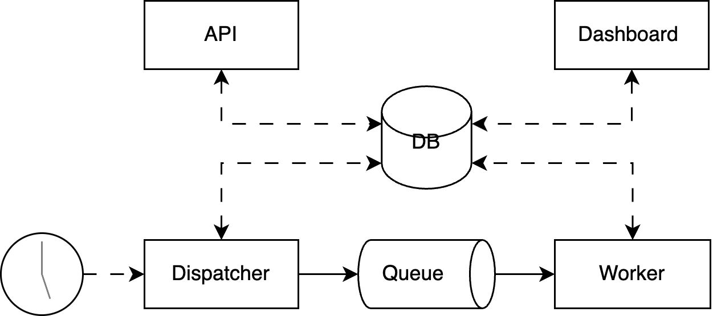

# Healthchecker

This Project was created as part of my Bachelor Thesis "Mining GitHub Repositories to Design and Implement a Representative FaaS Application".  Healthchecker is an educational, serverless application, intended to help better understand what real world Serverless applications look like.

## Architecture

Healthchecker currently runs on AWS Lambda using DynamoDB, SQS and Event Bridge, but is designed in a way that allows adding support for other Cloud Providers such as GCP or Azure later on. Following this incitement, the application uses Terraform with esbuild based build scripts instead of the very popular AWS SAM or other deployment Frameworks.

The application consists of four serverless functions: (1) API, (2) Dashboard, (3) Dispatcher and (4) Worker.

## Setup Instructions

- Configure your AWS credentials. An example direnv config can be found in `.envrc.example`.
- Build the application
  - `cd application`
  - `npm run build`
- Deploy the application
  - `cd infrastructure`
  - `terraform init`
  - `terraform apply`
- Get API and Dashboard URLs and the API Key: `terraform output -json`
- Create a health check
  - `curl --location 'https://<API_URL>/healthCheck' --header 'Content-Type: application/json' --header 'Authorization: Bearer <API_KEY>' --data '{ "url": "<DOMAIN_TO_WATCH>", "method": "GET", "intervalSeconds": 60, "expectedStatus": 200 }'`
- View health check results in the dashboard: `https://<DASHBOARD_URL>/dashboard/<HEALTH_CHECK_ID>`
